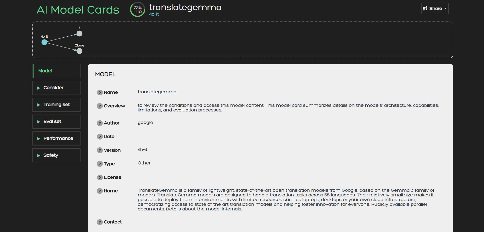

# AI Card

*A model card catalogue. Host it or use the public version. Create and access cards from the browser or your experiment tracking code.*



1. Select a model card catalogue. Temporarily host one 
locally as a service with minimal setup that you can access
from a browser-based UI, or use our public service at
[trai.mever.gr](https://trai.mever.gr/).

2. Install *aicard* in a Python environment 
and then link to the catalogue for creating a new model card
storing your model's properties:

```python
import aicard as aic

conn = aic.connect("https://trai.mever.gr/", username="myname", password="mypassword", silent=True)
with conn.create() as card:
    card.title = "my new card"
```

## 🔥 Features

- Browse model cards.
- Lightweight deterministic question-answering.
- Use LLMs to help refine your model cards.
- Integrate into your experimental pipeline.

## 🔗 Material

- [Create and upload cards programmatically](docs/create.md)
- [Host a local server](docs/host.md)
- [UI guide](https://trai.mever.gr/transparency/handbook.html)
- [Contributor guidelines](CONTRIBUTING.md)

## 📜 About

**License:** Apache 2.0<br>
**Maintainers:** TBD
